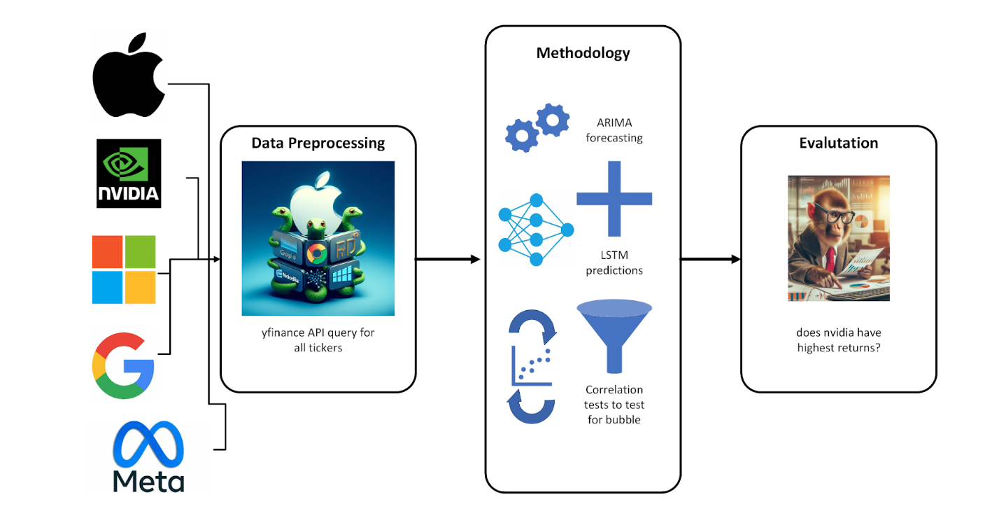

[![Contributors][contributors-shield]][contributors-url]
[![Issues][issues-shield]][issues-url]
[![MIT License][license-shield]][license-url]

<br />
<div stye="text-align: center;">

  <a href="https://docs.google.com/document/d/1Ogc_fDFur5ebfYvcQRNJP6mY8pvGBdkM2v2or5iNmN8/edit?usp=sharing">
    </img>
  </a>
</div>
<br />

# Stock Market Time Series Prediction

<details>
  <summary><strong>Table of Contents</strong></summary>
  <ol>
    <li><a href="#authors">Authors</a></li>
    <li><a href="#repository-contents">Repository Contents</a></li>
    <li><a href="#software-and-platform">Software and Platform</a></li>
    <li><a href="#file-tree">File Tree</a></li>
    <li><a href="#reproducing-results">Reproducing Results</a></li>
  </ol>
</details>
<br />

## Authors: 
Maajid Husain - mah2ksc@virginia.edu <br />
Colby Le - ncc9kn@virginia.edu <br />
Mohammad Murad - vdr4jr@virginia.edu

## Repository Contents
This is a time series analysis of companies we have determined to have a significant amount of 'hype' due to the AI bubble. The research question of interest concerns the proliferation of AI as a tool to predict stock prices of these AI/tech companies. Financial experts predict that NVIDIA will be the strongest tech stock of the next six months, so we are interested in utilizing AI to support that claim. Using the `yfinance` package, we are able to pull historical stock data for a number of tech companies, and then use the ARIMA model to predict the closing prices of Apple, Google, Meta, Microsoft, and NVIDIA in the next 6 months.

In the SCRIPTS directory there is the [`data_aquisition.ipynb`](DATA/data_aquisition.ipynb) script that loads `yfinance` historical stock data (which is updated to the present month) into dataframes, and then loading that into the [DATA] folder as CSV files: [`DATA/Alphabet_Google.csv`](DATA/Alphabet_Google.csv), [`DATA/Apple.csv`](DATA/Apple.csv), [`DATA/Meta Platforms.csv`](Meta Platforms.csv), [`DATA/Microsoft.csv`](Microsoft.csv), and [`DATA/NVIDIA.csv`](DATA/NVIDIA.csv). [SCRIPTS/EDA.ipynb](SCRIPTS/EDA.ipynb) performs exploratory data analysis on the data, including visualizations of the closing prices of the companies, and the distribution of the closing prices. [SCRIPTS/ARIMA.ipynb](SCRIPTS/ARIMA.ipynb) utilizes the ARIMA model, first using it to measure its predictive accuracy by comparing predicted historical closing prices compared to the true historical closing prices, then it predicts closing prices for the next 6 months. There is also a master script [SCRIPTS/master_script.ipynb](SCRIPTS/master_script.ipynb) that runs all the above scripts in order.

## Software and Platform
We are writing our scripts in Jupyter notebooks for readability. Notable packages we used were `yfinance` to source our data, the `statsmodels` package for the ARIMA model, the `pmdarima` package for the auto_arima model (which automatically selects hyperparameters) and Numpy, Pandas, and Matplotlib for working with/graphing data. We chose VSCode Mac/Windows as our preferred IDE and Git for version control.

## File Tree
```
.
├── DATA
│   ├── Aphabet_Google.csv
│   ├── Apple.csv
│   ├── DataAppendix.pdf
│   ├── Meta Platforms.csv
│   └── Microsoft.csv
│   └── NVIDIA.csv
├── LICENSE
├── OUTPUT
│   ├── apple_historic.png
│   ├── google_historic.png
│   ├── meta_historic.png
│   ├── microsoft_historic.png
│   ├── nvidia_historic.png
├── README.md
└── SCRIPTS
    ├── analysis_plan.png
    ├── ARIMA.ipynb
    ├── data_acquisition.ipynb
    ├── EDA.ipynb
```

## Reproducing Results
1. Review the SCRIPTS/analysis_plan.png
2. Run the SCRIPTS/data_acquisition.ipynb notebook to write the csv files into the DATA directory (or alternatively simply use the existing files in the directory)
3. Run the SCRIPTS/EDA.ipynb notebook to glean insights from the data, including visualizations of the closing prices of the companies, and the distribution of the closing prices.
4. Run the SCRIPTS/ARIMA.ipynb notebook to utilize the ARIMA model, first using it to measure its predictive accuracy by comparing predicted historical closing prices compared to the true historical closing prices, then it predicts closing prices for the next 6 months.
5. OR: run the master script SCRIPTS/master_script.ipynb to run all of the above steps in sequential order.

[contributors-shield]: https://img.shields.io/github/contributors/maajidhusain/DS-4002-Project-2.svg?style=for-the-badge
[contributors-url]: https://github.com/maajidhusain/DS-4002-Project-2/graphs/contributors
[stars-shield]: https://img.shields.io/github/stars/maajidhusain/DS-4002-Project-2.svg?style=for-the-badge
[issues-shield]: https://img.shields.io/github/issues/maajidhusain/DS-4002-Project-2.svg?style=for-the-badge
[issues-url]: https://github.com/maajidhusain/DS-4002-Project-2/issues
[license-shield]: https://img.shields.io/github/license/maajidhusain/DS-4002-Project-2.svg?style=for-the-badge
[license-url]: https://github.com/maajidhusain/DS-4002-Project-2/blob/master/LICENSE
[product-screenshot]: public/Images/_Common